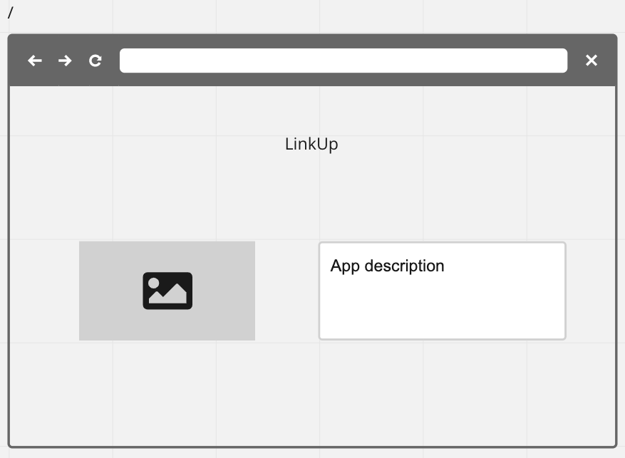
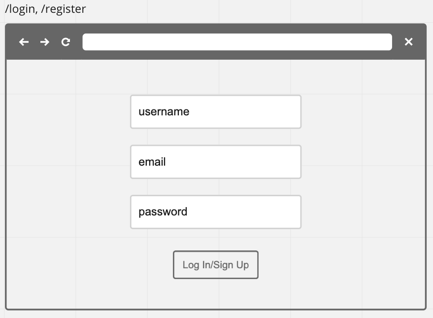
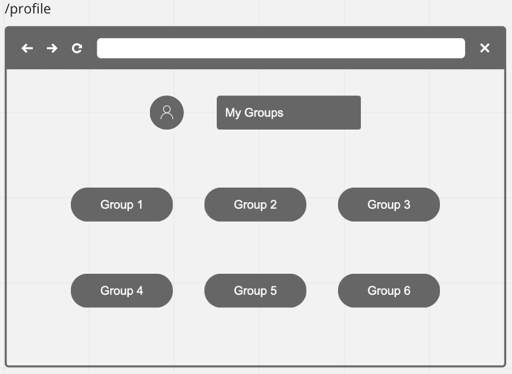
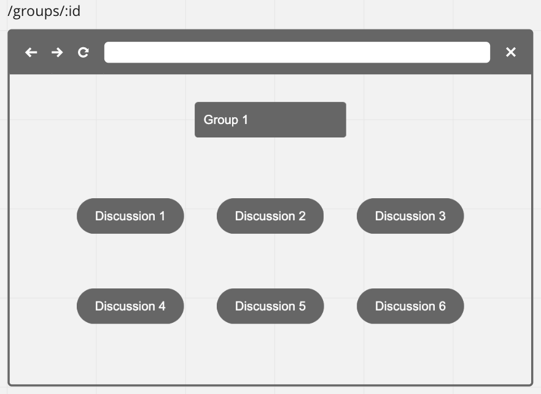
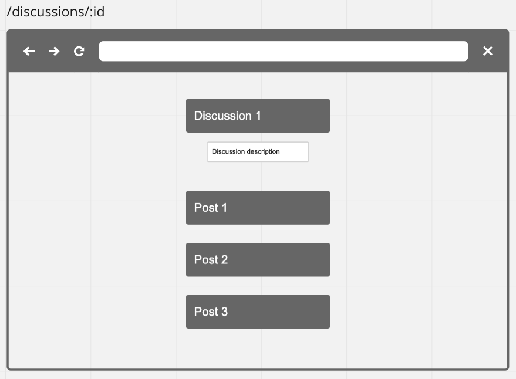
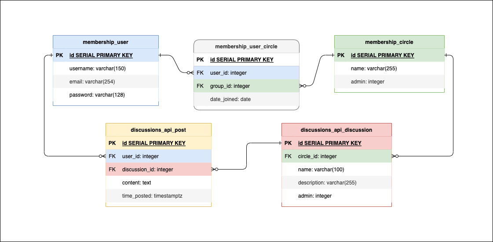

1. How do you plan on learning/implementing this new technology?
- Gitbook
- Django Tutorial/Documentation
- Online tutorials/articles/guides/stackoverflow
- Instructors' graceful assistance...

2. What is your goal with this project?
- To learn more about python and django in use and perhaps gain some familiarity
- To begin creating a functioning application that allows for many stretch goals that can be implemented post-cohort

3. Who is the user for your app?
- Anyone using the internet that wishes to engage with their friends more intentionally 

4. Any potential roadbloacks you think you might run into? 
- Learning a new, albeit widely used, technology does not instill much confidence over planning out the scope of the project
- I will try to start out with what I envision is a reasonable mvp, but this may still be biting off more than I can chew 
- With what I understand of python and django now, I'm not completely certain as to the scope of what I can learn and execute within a week's time, compared to what I might be able to do with familiar technologies (i.e. express and javascript)
- It will be interesting to see how similar tasks are accomplished by the framework and hopefully to see what else python/django has to offer

# Technologies Planned for Use
- Python
- Django
- Postgres
- React
- Axios

# Project Description

As the world quickly got thrown into the chaos of COVID, many status quos were dynamically shifted. An absurd number of people across the globe saw negative impacts to too many parts of their lives, all at once. One of these facets was the dissolution of social connections, which has been a detriment to the mental well-being of a widespread population - an issue that is often deprioritized in lieu of more pressing or 'pragmatic' problems. Human beings are by nature communal creatures at our core and I want to leverage technology to address a basic need that society often deems simply extracurricular. I hope that this application will serve as a useful tool to help people gather together and engage one another to form progressively more genuine connections. 

# User Flow/User Stories
- As a user, I want to make a group and add my friends (mvp for admin to add any users, stretch for social-media style mutual add)
- As a user, I want a separate space to discuss specific topics, so that friends in the group will only have to see the content if they are interested
- As a user, I want to be able to create a post so that I can connect with my friends
- As a user, I want to be able to edit a post if I make a typo
- As a user, I want to be able to delete any posts that I created
- As a user, I want to be able to join multiple groups 
- As a user, I want to be able to see who is in my groups
- As a user, I want to be able to leave groups if needed

# Stretch Goals
- Add ability to comment on specific posts
- Add sorting functionality for discussions
- Differentiate between public and private groups
- Add event making functionality (post-cohort stretch google calendar api)
- Polls for where to meet
- Add cloudinary photo posting
- Add youtube video embedding
- Add chatroom in groups (post-cohort stretch socket.io)
- Add video/voice in chat (post-cohort stretch agora)
- Sass for styling

# Wireframes

# ERD

# Front-End URL Patterns (React Routes)
| Path               | Purpose                                                 |
| ------------------ | ------------------------------------------------------- |
| `/`                | Landing Page                                            |
| `/login`           | Login Page                                              |
| `/register`        | Register Page                                           |
| `/profile`         | User home page that displays user's groups              |
| `/groups/:id`      | Group page that displays groups's discussions and users |
| `/discussions/:id` | Discussion page that displays discussions's posts       |

# RESTful Routing
| Method | Path                        | Purpose                                                          |
| ------ | --------------------------- | ---------------------------------------------------------------- |
| POST   | `membership/register`       | CREATE a new user                                                |
| POST   | `membership/login`          | logs in an existing user, adds token to user and sends it back   |
| DELETE | `membership/logout`         | logs user out, removes token from user, deletes all session data |
| GET    | `membership/users/:id`      | READ all groups associated with current user                     |
| POST   | `membership/groups`         | CREATE a new group, makes current user admin                     |
| PUT    | `membership/groups/:id`     | UPDATE a group with :id, if admin                                |
| DELETE | `membership/groups/:id`     | DELETE a group with :id, if admin                                |
| GET    | `membership/groups/:id`     | READ all discussions and users associated to group with :id      |
| POST   | `membership/groups/:id/add` | CREATE a new M:N connection between group with :id and user      |
| DELETE | `membership/groups/:id/del` | DELETE the M:N connection between group with :id and user        |
| POST   | `api/discussions`           | CREATE a new discussion, makes current user admin                |
| PUT    | `api/discussions/:id`       | UPDATE a discussion with :id, if admin                           |
| DELETE | `api/discussions/:id`       | DELETE a discussion with :id, if admin                           |
| GET    | `api/discussions/:id`       | READ all posts associated to discussion with :id                 |
| POST   | `api/posts`                 | CREATE a new post, makes current user owner                      |
| PUT    | `api/posts/:id`             | UPDATE a post with :id, if owner                                 |
| DELETE | `api/posts/:id`             | DELETE a post with :id, if owner                                 |

# Sprints
- Tuesday: Review/Research Python/Django
- Wednesday: Begin back-end construction
- Thursday: Finish back-end and begin React front-end
- Friday: Finish front-end
- Saturday: Styling and refactoring